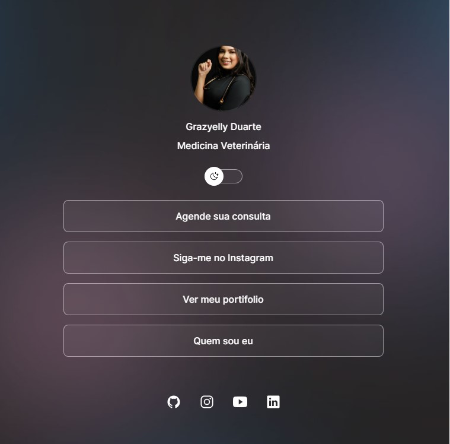

<h1 align="center"> Feito através do curso discover com o projeto DevLinks pela Rocketseat </h1>

Programa exclusivo e gratuito, promovido pela Rocketseat para ensino de tecnologias WEB.  

Pomeio deste estou realizando o ProProjeto Grazielly Duarte  

  <a href="#-tecnologias">Tecnologias</a>&nbsp;&nbsp;&nbsp;|&nbsp;&nbsp;&nbsp;
  <a href="#-projeto">Projeto</a>&nbsp;&nbsp;&nbsp;|&nbsp;&nbsp;&nbsp;

  

## 🚀 Tecnologias

Esse projeto foi desenvolvido com as seguintes tecnologias:

- HTML e CSS
- JavaScript
- Git e Github
- Figma
- Nodejs 
- Express

## 💻 Projeto

Algumas coisas ainda estou aprendendo para implementar posteiormente 

- [Acesse ao andamento do projeto, online](https://srjohn1.github.io/Project-DevLinks/#)

Esse projeto está sob a licença MIT.

---

